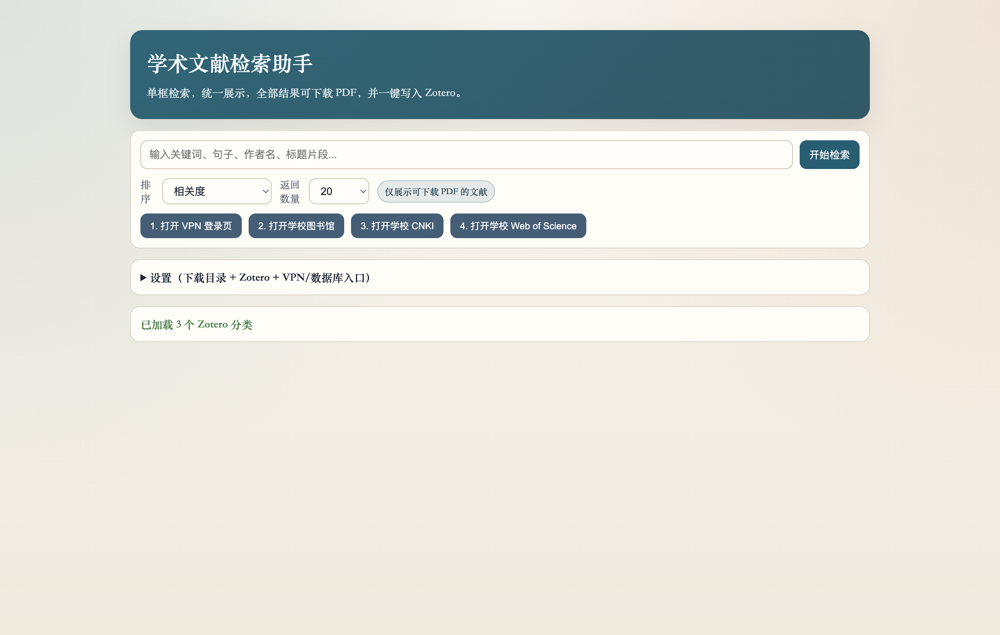
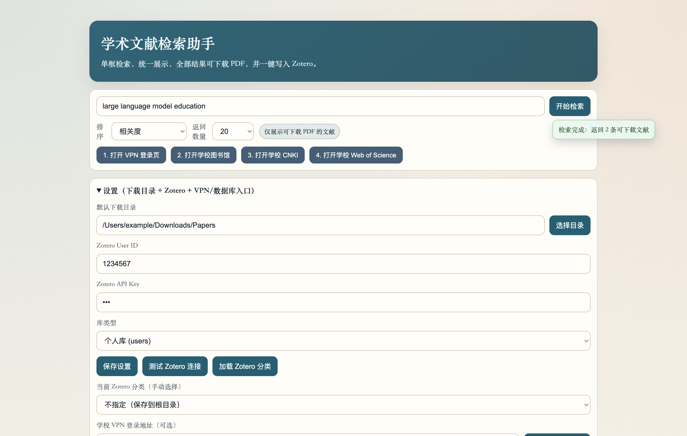

# 学术文献检索助手（macOS）

## 中文介绍

`学术文献检索助手` 是一个面向教师与研究者的 macOS 桌面工具。  
它把检索、筛选、下载、入库整合到一个界面：输入关键词后，返回可下载文献并提供中英标题/摘要对照；你可以一键下载 PDF，或一键写入 Zotero 指定分类。  
工具支持“VPN -> 学校图书馆 -> CNKI / Web of Science”访问流程，适合在校内外统一使用。

主要检索覆盖：  
- 程序内聚合检索：OpenAlex、arXiv  
- 学校订阅入口检索：CNKI、Web of Science、Google Scholar、OpenScholar

## English Introduction

`Literature Finder Desktop` is a macOS app designed for researchers and faculty members.  
It combines search, evaluation, downloading, and Zotero filing into one workflow: type a query, get downloadable papers with bilingual title/abstract display, then save PDF or send the item to a selected Zotero collection in one click.  
It also supports a campus-access workflow via `VPN -> Library Portal -> CNKI / Web of Science`, making it practical for both on-campus and off-campus use.

Primary coverage:  
- Built-in aggregated search: OpenAlex, arXiv  
- Institution subscription entry search: CNKI, Web of Science, Google Scholar, OpenScholar

把“找文献”这件事变成一个顺滑动作：

- 一个检索框输入关键词/句子/作者/标题片段
- 直接返回可下载文献（只展示可下载项）
- 标题和摘要中英对照
- 一键下载 PDF
- 一键写入 Zotero（手动选择分类）
- 支持“VPN -> 学校图书馆 -> CNKI / Web of Science”访问流程

## 主要检索数据库

程序内聚合检索（自动返回可下载结果）：

- OpenAlex
- arXiv

学校订阅入口检索（通过 VPN/图书馆权限访问）：

- CNKI（中国知网）
- Web of Science
- Google Scholar
- OpenScholar（Semantic Scholar）

## 界面预览

### 首页（单框检索 + 一键流程入口）



### 检索结果（中英标题/摘要 + 下载/Zotero）


### 设置面板（Zotero + VPN + 数据库入口）



## 为什么好用

- 面向教师/研究者的真实流程设计：检索、判断、下载、入库一屏完成
- 对下载做了多链接回退和落地页解析，减少“能看不能下”
- Zotero 连接支持自动识别 User ID，并在界面提示读写权限状态

## 主要功能

- 单框检索（关键词、自然语言句子、作者名、标题片段）
- 排序：相关度 / 年份 / 被引次数
- 只展示可下载 PDF 的结果
- 标题双语 + 摘要双语
- 每条文献两个核心按钮：`下载 PDF`、`保存到 Zotero`
- 四步快捷入口：`VPN` -> `图书馆` -> `CNKI` -> `Web of Science`

## 2 分钟上手

### 1) 安装与启动

```bash
npm install
npm start
```

### 2) 配置 Zotero（首次）

在设置里填写：

- `Zotero API Key`（必填）
- `库类型`（默认 `users`）
- `Zotero User ID`（可留空，自动识别）

然后点击：

1. `测试 Zotero 连接`
2. `加载 Zotero 分类`
3. 选择目标分类

### 3) 配置学校访问入口（首次）

在设置里填写：

- `学校 VPN 登录地址`
- `学校图书馆入口地址`
- `学校 CNKI 入口`
- `学校 Web of Science 入口`

说明：入口地址支持 `{query}` 占位符。示例：

```txt
https://example.edu.cn/proxy/cnki?kw={query}
```

### 4) 日常使用

1. 检索关键词
2. 浏览中英标题/摘要
3. 点 `下载 PDF` 或 `保存到 Zotero`

## 常见问题

### 下载失败（403/站点限制）

- 先通过 App 的快捷按钮登录 VPN
- 再进入学校图书馆和对应数据库
- 重新下载（程序已内置多链接回退）

### Zotero 报 `Write access denied`

你的 API Key 没有写权限。到 [Zotero Keys](https://www.zotero.org/settings/keys) 重新创建/编辑 key，开启写权限后再试。

## 项目结构

- `main.js`：Electron 主进程与下载逻辑
- `preload.js`：安全桥接 API
- `src/index.html`：界面结构
- `src/styles.css`：界面样式
- `src/renderer.js`：前端交互与状态提示
- `src/services/searchService.js`：检索聚合与结果处理
- `src/services/translator.js`：双语转换
- `src/services/zoteroService.js`：Zotero API 连接与写入

## 打包 macOS App

```bash
npm run dist
```

输出目录：`dist/`
